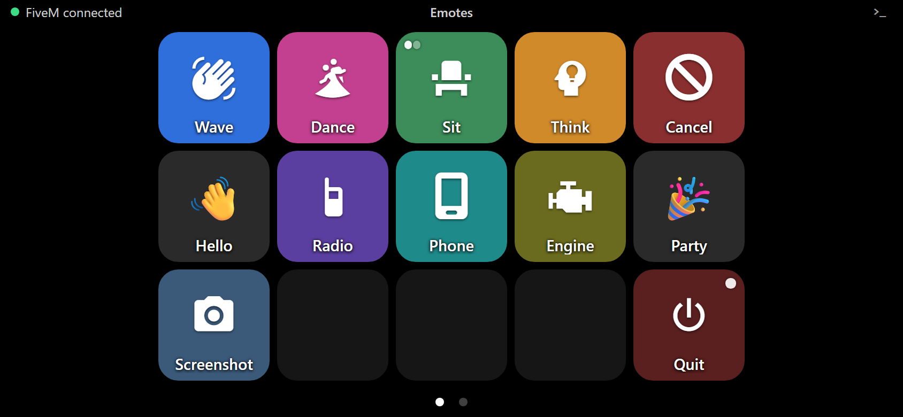
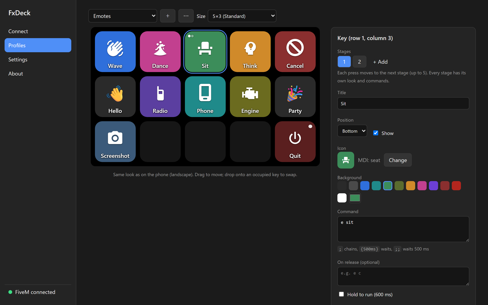
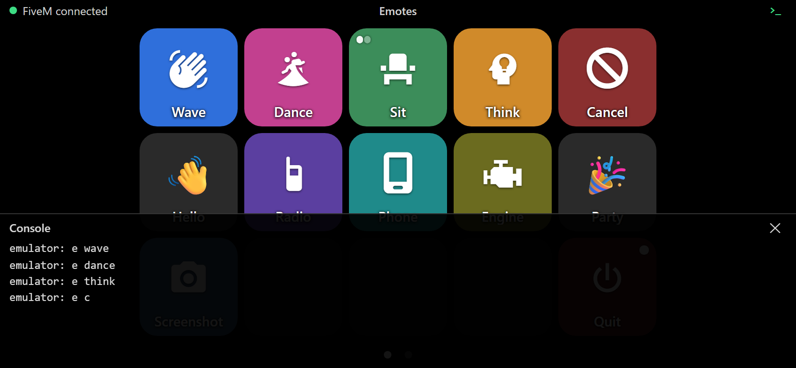
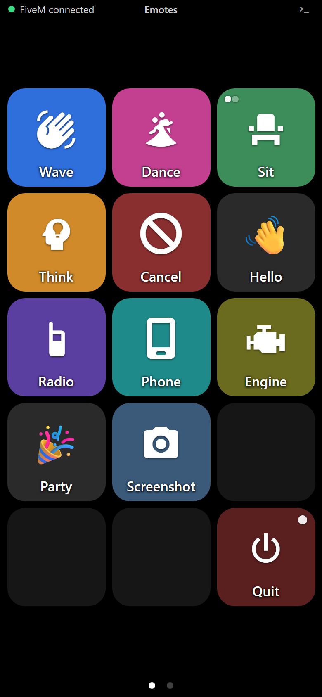

# FxDeck

**FiveM / RedM 用の Stream Deck 風コマンドデッキ。スマホのブラウザで動きます。**

FxDeck は Windows のタスクトレイに常駐する単一の exe です。同じ PC で動いている FiveM / RedM クライアントのコンソールソケットに接続し、家庭内 Wi‑Fi 経由でスマホにボタンのグリッドを配信します。ボタンを押すと、そこに設定したコマンド（`e wave`、`say hello`、ディレイ付きのチェーンなど）がゲームのコンソールに送られます。Stream Deck のハードもサブスクもアプリストアも不要です。

[English README](README.md)

<p align="center">
  
</p>

## 機能

- **スマホがデッキになる** — 大きな正方形キーの固定グリッド（3×2 / 5×3 / 8×4 / カスタム）。横向き・縦向き対応、スワイプでプロファイル（ページ）を切り替え。PWA なのでホーム画面に追加すると全画面で開きます。
- **アイコン** — Material Design Icons、Font Awesome Free、Unicode 絵文字、任意の画像（PNG / JPEG / WebP / GIF、256×256 に縮小）。
- **コマンドマクロ** — `cmd1; cmd2` のチェーン、`{500ms}` のディレイ、`;;` は 500ms の省略記法（fxcommands 互換）。`quit` のような危険なキーには「長押しで実行」。
- **押す／離す と ステージ** — 押したときと離したときで別のコマンドを送るキー（押している間 `e sit`、離すと `e c`）や、押すたびにアイコンとコマンドが切り替わる最大 5 段のステージキー（座る／立つのトグルなど）。
- **コンソール表示** — ゲームのコンソール出力をスマホの引き出しにリアルタイム表示。
- **PC で編集、スマホで確認** — 管理画面は PC のブラウザで動作。変更は自動保存され、接続中のスマホに即時反映。編集しながら「テスト送信」で確認できます。
- **QR で接続** — ペアリングもアプリも不要。QR にはアクセストークンが入っており、デッキはトークンで保護、管理画面は `localhost` からのみアクセス可。
- **Wi‑Fi が届かなくても** — Cloudflare Tunnel（アカウント不要の TryCloudflare、または自分の Zero Trust トンネルによる固定 URL）で別ネットワークのスマホからも接続可能。
- **インポート／エクスポート** — プロファイル単位または全体を `.fxdeck` ファイルに（画像込み）。
- **ダーク／ライトテーマ、日本語／英語 UI**、Windows 起動時の自動起動、Windows ファイアウォールの許可ボタン。

<p align="center">
  
</p>

<p align="center">
  
  
</p>

## 動作環境

- Windows 10 / 11（x64）。推奨のダウンロードは自己完結型なので .NET のインストールは不要です。
- 同じ PC 上の FiveM または RedM クライアント（FxDeck はクライアントのコンソールソケット `127.0.0.1:29200` に接続します）。
- モダンなブラウザを持つスマホ（またはタブレット）— iOS の Safari、Android の Chrome — が PC と同じネットワークにあること。または Cloudflare Tunnel（後述）。

## はじめかた

1. [Releases](https://github.com/Acc-Off/FxDeck/releases) から `FxDeck-<version>-win-x64.exe` をダウンロードして実行します。コード署名していないため、Windows SmartScreen の警告が 1 回出ることがあります（「詳細情報」→「実行」）。FxDeck はタスクトレイに常駐し、初回起動時は管理画面がブラウザで自動的に開きます（2 回目以降はトレイアイコンをダブルクリック）。
   - `…-slim.exe` はずっと小さい版（約 60MB に対して約 3MB）ですが、.NET 10 の **Desktop Runtime** と **ASP.NET Core Runtime**（x64）を https://dotnet.microsoft.com/download/dotnet/10.0 から入れておく必要があります。既に入っている場合だけ選んでください。
2. Windows ファイアウォールが FxDeck の許可を尋ねてきたら **許可** します。キャンセルしてしまった場合は、接続ページの **許可する** ボタンを使ってください（UAC 付きで `netsh` を実行します）。
3. FiveM / RedM を起動します。管理画面の状態表示が「FiveM 接続中」に変わります。
4. 接続ページの **同じネットワークから** の QR コードをスマホで読み取ります。デッキが開くので、ホーム画面に追加すると全画面アプリのように使えます。
5. **プロファイル** ページでプレビューのキーをクリックし、タイトル・アイコン・色・コマンドを設定します。入力するそばからスマホに反映されます。

### コマンドの書き方

| 記法 | 意味 |
|---|---|
| `e wave` | コンソールコマンド 1 つ |
| `e think; {2000ms}; e c` | 順に実行し、間に 2 秒待つ（`;` または改行で区切る） |
| `a ;; b` | `;;` は 500ms 待つ |
| `{ 1500 ms }` | ディレイは大文字小文字を区別せず、空白も可。上限 60 秒 |

コマンドは 1 つずつ小さな間隔を空けてゲームに送られるので、長いチェーンもコンソールに手で打つのと同じように動きます。

### ホールドキーとステージ

- **離したとき** — 任意の「離したとき」欄を埋めるとホールドキーになります。触れた瞬間にコマンドを、指を離した瞬間に「離したとき」のコマンドを送ります（スマホの通信が切れたときも離したものとして送るので、掛かりっぱなしになりません）。例: 押したとき `e sit`、離したとき `e c`。
- **ステージ** — 編集パネルでステージを追加します（最大 5）。ステージごとにタイトル・アイコン・色・コマンドを持ち、押すたびに次のステージへ進みます。キーには現在位置を示すドットが出ます。現在のステージは PC 側が持つのでどのスマホでも同じに見え、FxDeck の再起動や送信の失敗でリセットされます。

### スマホからデッキが開けないとき

- PC とスマホが **同じネットワーク** にある必要があります。モバイル回線、ゲスト Wi‑Fi、AP 分離（プライバシーセパレータ）は障害になります。
- 接続ページの「スマホから開けない場合」で **Windows ファイアウォール** の状態を確認してください。
- NIC が複数ある PC で QR のアドレスが違う場合は、**設定 → デッキ** でアダプタを選びます。
- それでも駄目なら接続ページの **別ネットワークから** を使います。FxDeck が Cloudflare Tunnel を開始し（初回は `cloudflared` を約 55MB ダウンロード）、公開 URL `https://…trycloudflare.com` の QR を表示します。URL は開始のたびに変わります。使い終わったらトンネルを停止してください。
- 固定 URL にしたい場合は、Cloudflare Zero Trust でトンネルを作成し、公開ホスト名の転送先を `http://127.0.0.1:<デッキポート>`（既定 20200）にして、トンネルトークンと公開 URL を **設定 → トンネル** に入力します。転送先のポートが違うと Cloudflare が 502 を返します。

### セキュリティについて

- QR コードとデッキ URL にはアクセストークンが含まれます。これを知っている人は誰でもゲームにコンソールコマンドを送れます。スクリーンショットを共有しないでください。**設定 → セキュリティ → デッキトークンの再発行** で全端末を一度に無効化できます。
- 管理画面は `127.0.0.1` でのみ待ち受け、認証はありません。PC の前にいる本人が使う前提です。
- LAN 内の通信は平文 HTTP です（自己署名 HTTPS はスマホで使えないため）。家庭内ネットワークでの利用を想定しています。Cloudflare Tunnel 経由は HTTPS です。

### データの保存場所

`%LOCALAPPDATA%\FxDeck`（トレイメニュー → **データフォルダを開く**）:

| パス | 内容 |
|---|---|
| `config.json` | 設定とプロファイル。手で編集しても即座に反映されます |
| `deck-token` | アクセストークン |
| `assets\` | アップロードしたキー画像（`<sha256>.png`） |
| `logs\fxdeck.log` | ログ（1MB でローテーション） |
| `cloudflared\` | トンネルを初めて開始したときにダウンロードされる `cloudflared.exe` |

### コマンドライン

```
FxDeck [options]

  --console            デッキ URL・QR コード・ログを呼び出し元の端末に表示
  --host <ip>          ゲームコンソールのホスト（既定: config.json、初期値 127.0.0.1）
  --port <port>        ゲームコンソールのポート（初期値 29200）
  --deck-port <port>   デッキ UI のポート（初期値 20200）
  --admin-port <port>  管理 UI のポート（初期値: 自動）
  --data-dir <dir>     データディレクトリ（既定 %LOCALAPPDATA%\FxDeck。環境変数 FXDECK_DATA_DIR も可）
  --send "<macro>"     Web サーバーを立てずにマクロを 1 回送信して終了
  --timeout <ms>       --send がゲームを待つ時間（既定 10000）
  -v                   詳細ログ
```

`FxDeck.exe --send "e wave"` はスクリプトやホットキーからの利用に便利です。

## ソースからのビルド

必要なもの: [.NET 10 SDK](https://dotnet.microsoft.com/download) と Node.js 22 以降。

```
git clone https://github.com/Acc-Off/FxDeck.git
cd FxDeck
dotnet build FxDeck.slnx        # npm ci && npm run build も実行し、SPA を exe に埋め込む
dotnet test FxDeck.slnx --no-build
dotnet publish src/FxDeck -c Release -r win-x64 --self-contained true -p:PublishSingleFile=true -p:EnableCompressionInSingleFile=true
```

slim 版（フレームワーク依存）は `--self-contained false` にして圧縮フラグを外します。リリースは `v*` タグの push で [.github/workflows/release.yml](.github/workflows/release.yml) がビルドします。

ゲーム無しで開発するには、`dotnet run --project src/FxDeck.Emulator` でポート 29200 に FiveM のコンソールソケットのエミュレータを立て、`dotnet run --project src/FxDeck -- --console --data-dir <temp>` で一時データディレクトリを使って FxDeck を起動します。フロントのホットリロードは `cd src/FxDeck.Web && npm run dev`。

```
src/FxDeck/            Windows トレイアプリ + ASP.NET Core（Minimal API、Kestrel、WebSocket）
src/FxDeck.Web/        Vite + React + TypeScript の SPA（デッキと管理画面）。exe に埋め込まれる
src/FxDeck.Emulator/   開発・テスト用のコンソールソケットエミュレータ
tests/FxDeck.Tests/    xUnit テスト
Docs/                  設計ドキュメント
```

設計ドキュメントは [Docs/](Docs/) にあります: [DesignNote.ja.md](Docs/DesignNote.ja.md)（アーキテクチャ、プロトコル、データモデル）と [UIUX.ja.md](Docs/UIUX.ja.md)（画面とフロー）。メンテナ向けのメモは [DevelopmentNote.ja.md](Docs/DevelopmentNote.ja.md)。

## 仕組み

FiveM / RedM クライアントは `127.0.0.1:29200` にコンソールソケットを開いています。FxDeck はそこへの接続を維持し、コマンドを `CMND` フレームで送り、`PRNT` フレーム（コンソール出力）をスマホに中継します。このプロトコルは **非公式** で、[fxcommands](https://github.com/josh-tf/fxcommands) を参考に解析したものです。ゲームの更新で変わる可能性があります。Web 側は Kestrel の 2 リスナー（管理 API はループバック限定、デッキは全インターフェースでトークン必須）と 1 つの React SPA です。

## 免責

FxDeck は独立したプロジェクトであり、Cfx.re / Rockstar Games（FiveM、RedM）や Elgato（Stream Deck）とは無関係です。利用は参加しているサーバーのルールに従ってください。

## ライセンス

[MIT](LICENSE)。第三者コンポーネントとそのライセンスは [THIRD-PARTY-NOTICES.md](THIRD-PARTY-NOTICES.md) と管理画面の About ページに記載しています。Font Awesome Free のアイコンは CC BY 4.0 に基づいて使用しています。
